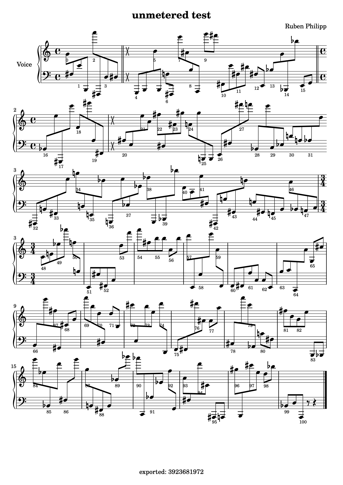

## INTRODUCTION

This repository is a fork from Orm Finnendahl's
[fork](http://github.com/ormf/fomus) (sic!) of David Psenicka's
[fomus](http://fomus.sourceforge.net).

It includes some additions which deemed useful for my practice, for example
the possibility to define "unmetered" time-signatures:

```
(fms:fomus
 :title "unmetered test"
 :composer "Ruben Philipp"
 :verbose 2
 :output '((:lilypond
            :view t))
 :filename "/tmp/mode-test1"
 :global (list
          (fms:make-timesig :off 0 :time '(4 4)
                            :props '((:barline :single)))
          (fms:make-timesig :off 4 :time '(3 4)
                            :props '((:mode :unmetered)
                                     (:barline :double)
                                     ))
          (fms:make-timesig :off 16     ;;:time '(4 4)
                            :props '((:mode :metered)
                                     (:barline :double)))
          (fms:make-timesig :off 20 :time '(4 4)
                            :props '((:mode :unmetered)))
          (fms:make-timesig :off 24 :props '((:mode :unmetered)))
          (fms:make-timesig :off 48 :time '(3 4)
                            :props '((:mode :metered))))
 :ensemble-type :orchestra
 :quartertones nil
 :parts
 (list
  (fms:make-part
   :name "Voice"
   :instr :piano
   :events
   (loop for i from 0 to 100 by 1/2
         for pos from 0
         collect
         (fms:make-note
          :off i
          :note (+ 60 (random 20))
          :marks `(,(if (integerp i)
                        `(:text ,(write-to-string i))
                        ':ignore))
          :dur .5)))))
```




## ORIGINAL README FROM ORM FINNENDAHL'S FORK

### OVERVIEW

fomus is a software application for formatting musical output written
by David Psenicka (see: http://fomus.sourceforge.net).

This repository is a package derived from the common lisp port of
fomus with some small modifications due to lilypond api changes and
some enhancements for my personal use.

(c) of the modifications by Orm Finnendahl 2016, released under the
LLGPL v2.0 (like the original code of David Psenicka), see file
LICENSE, no warranties whatsoever.

### PREREQUISITES

- sbcl Common Lisp (http://www.sbcl.org/) installed.
- Quicklisp (https://www.quicklisp.org/beta/) installed.
- lilypond and evince (or any other pdf viewer) installed.

### INSTALL

1. Link the folder "fomus" into "~/quicklisp/local-projects/".


### USAGE

1. Create a Text file with the name ".fomus" in your $HOME directory
with the following contents (adapt to your needs and don't forget to
set the correct path to the lilypond binary on your computer for
:lilypond-exe):

```
:output '((:data) (:lilypond :view t))

:lilypond-exe "/path/to/lilypond"
:lilypond-opts '("--pdf")
:lilypond-out-ext "pdf"

:lilypond-view-exe "/usr/bin/evince"
:cmn-view-exe "/usr/bin/evince"

:verbose 1
:min-tuplet-dur 1
:max-tuplet 13
:caut-acc-ottavas t
```


1. Load the project: 

``` (ql:quickload "fomus") ```


2. Generate a score (this score gets displayed using the command
"/usr/bin/evince"; in case another viewer is used, change the relevant
entry for :lilypond-view-exe in the ".fomus" file):

```
(in-package :fomus)

(fomus
 ;; :output '(:lilypond :view t)
 :composer ""
 :parts
 (list
  (make-part
   :name "Klavier"
   :instr :piano
   :events
   (loop
      for off from 0 to 10 by 1/2
      collect (make-note :off off
                         :dur (if (< off 10) 1/2 1)
                         :note (+ 48 (random 25)))))))
```
